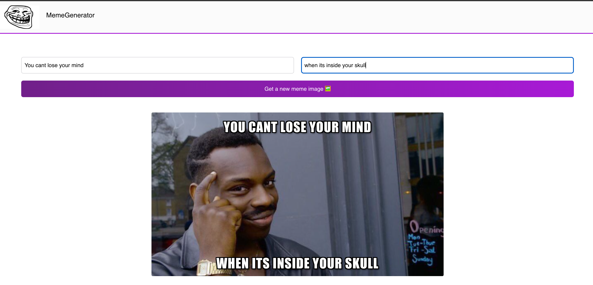

# Meme Generator

A React application for creating custom memes using images supplied by the [Imgflip API](https://imgflip.com/api).

## Features

- Loads current meme templates from Imgflip
- Lets users add custom top and bottom text
- Generates a shareable meme from the selected template

## Built with

- React
- JavaScript
- CSS
- Imgflip API

[Live demo](https://meme-generat0r.netlify.app/) · [Report an issue](https://github.com/awar7118/memegenerator/issues)
